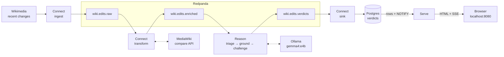
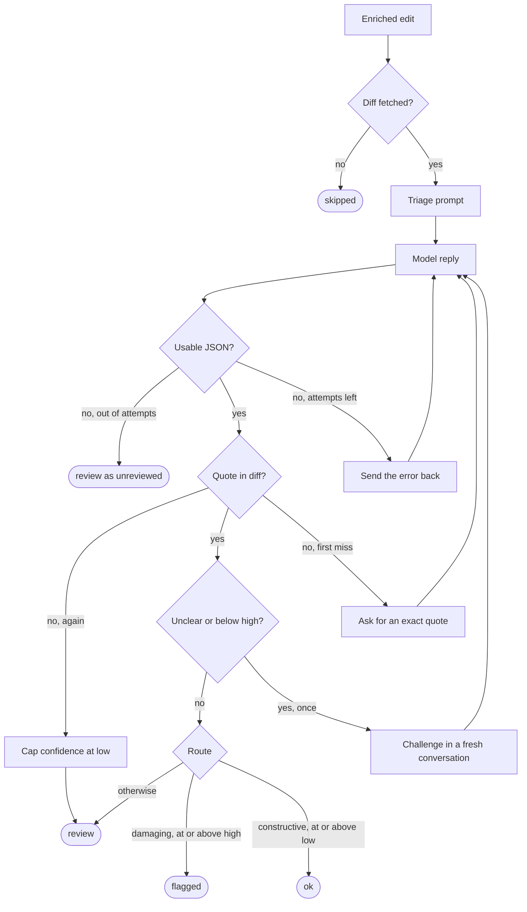

# redpanda-fde-build-exercise

Judge live Wikipedia edits with an LLM to enable a human to triage the damaging ones first.



A Connect [`http_client`](https://docs.redpanda.com/connect/components/inputs/http_client/) ingests the Wikimedia recent-changes firehose and ingests human edits to English articles to the `wiki.edits.raw` topic.

A Connect [`processor`](https://docs.redpanda.com/connect/components/processors/processors/) group then filters and tiers the raw changes and fetches the diff behind each one as a separate (rate-limited) external call. The filtered set of raw events are then stripped to include only the relevant fields, enriches them with the diff details and persists them to the `wiki.edits.enriched` topic. This step is necessary since the feed itself only says who changed which page and by how many bytes.

Reason then has a local model judge each diff, makes it quote its evidence, argues the close calls a second time, and writes a verdict back to the `wiki.edits.verdicts` topic.

A Connect [`sql_insert`](https://docs.redpanda.com/cloud-data-platform/develop/connect/components/outputs/sql_insert/) output sinks the verdicts into Postgres, and Serve turns that table into a live view at http://localhost:8080.

## Getting Started

You need Docker with Compose and about 12 GB of memory available to containers (the local model is 9.6 GB). On macOS that means raising the Docker Desktop or Colima memory limit.

The first start pulls `gemma4:e4b` into the Ollama volume, which takes a few minutes. `reason` waits until it is there.

```sh
docker compose up --build --detach
```

```sh
open http://localhost:8080
```

> [!TIP]
> `make up` does the same detached, opens the page in your browser once every service is up, and follows the logs.
> `make down` stops the stack.

Then open:
- http://localhost:8080 for the verdicts page, which updates as verdicts land
- http://localhost:8080/api/verdicts for JSON, filtered by `route`, `label`, `min_confidence`, and `limit`
- http://localhost:8080/api/stats for counts by route and label
- http://localhost:8081 for Redpanda Console, to look at the topics

On CPU the model takes tens of seconds per edit, so the first verdicts appear a minute or two after it finishes loading. Edits from logged-out editors, with an empty summary, or with a large byte change always reach the model. The rest are sampled at 5%.

> [!TIP]
> To use a hosted model instead, copy [`.env.example`](.env.example) to `.env` and set `LLM_BASE_URL`, `LLM_MODEL`, and `LLM_API_KEY`. Setting `OLLAMA_MODEL=` skips the download. Any provider that speaks the OpenAI chat-completions shape works. Ollama running natively on the host (`LLM_BASE_URL=http://host.docker.internal:11434/v1`) is much faster than Ollama in a container on a Mac.

### Things to Look At

**Loop** in [`reason/reason.go`](reason/reason.go) turns each edit into a routed verdict:



The model sees the title, the editor type, the summary, the byte delta, and the diff, and answers with a label, a confidence, a one-sentence reason, and a verbatim quote from the diff. The parser pulls the first JSON object that decodes out of whatever the model wrote, and the last attempt forces JSON mode. A quote counts as found when most of it appears in the diff as one unbroken run, since a small model mangles the odd character. The challenge must argue the opposite case before deciding. Its answer replaces the first unless it is unusable, in which case the first stands.

Labels are `constructive`, `vandalism`, `spam`, `unsourced_claim`, and `unclear`. `unreviewed` marks records the loop gave up on.

Reason commits an offset only after the verdict is on `wiki.edits.verdicts`. When it cannot reach the model or the broker it retries with backoff rather than recording a verdict ([`reason/consumer.go`](reason/consumer.go)).

**Prompts** in [`reason/prompt.go`](reason/prompt.go) are the system prompt that defines the labels and the JSON shape, the repair prompt for an unusable reply, the grounding prompt for a quote that is not in the diff, and the challenge prompt. Edit and rebuild `reason` to change them.

**Pipelines** are the three Connect configs. Everything that is not reasoning lives here.
- [`ingest/ingest.yaml`](ingest/ingest.yaml) reads the SSE firehose, keeps human edits to English Wikipedia articles, and writes them to `wiki.edits.raw`.
- [`transform/transform.yaml`](transform/transform.yaml) drops repeats and reverts, passes priority edits and a revision-id sample of the rest, fetches the unified diff from the MediaWiki compare API at 5 requests per second, and writes `wiki.edits.enriched`. A failed fetch is recorded on the message, not dropped, so the gate can skip it.
- [`serve/sink.yaml`](serve/sink.yaml) upserts verdicts into Postgres by revision id, one statement per verdict.

**Schema** in [`serve/schema.sql`](serve/schema.sql) is the `verdicts` table the sink upserts and Serve reads, plus the trigger that tells Serve about each upsert. The sink applies it on start.

**Env** vars are optional and go in `.env`:

| Variable          | Default | Description                                                                                                    |
| ----------------- | ------- | -------------------------------------------------------------------------------------------------------------- |
| `SAMPLE_PERMILLE` | `50`    | Non-priority edits that reach the model, per thousand, picked by revision id so a replay makes the same choice |
| `DIFF_MAX_CHARS`  | `4000`  | Longest diff sent to the model, in characters                                                                  |
| `HIGH_CONFIDENCE` | `0.8`   | Confidence at which a damaging verdict is flagged without a challenge                                          |
| `LOW_CONFIDENCE`  | `0.5`   | Confidence below which a constructive verdict goes to review                                                   |
| `MAX_ATTEMPTS`    | `3`     | Model calls per stage before the loop gives up                                                                 |
| `LOG_LEVEL`       | `info`  | `debug` logs every unusable model reply                                                                        |

**Testing** is `make test`. [`reason/reason_test.go`](reason/reason_test.go) drives the loop with a scripted model: dirty output, repairs, hallucinated evidence, the challenge pass, the exhausted budget, and the transport failure that must not produce a verdict. [`reason/parse_test.go`](reason/parse_test.go) covers the parser on its own. CI runs the same tests plus lint and a vulnerability check.

**Rebuild the table** with `make reset-sink`. It drops `verdicts`, deletes the sink's consumer group, and restarts the sink so it replays the topic from the beginning.

## Tradeoffs

### Connect as the Sink vs App-Side Writes From the Reasoning Service

The verdicts topic is the system of record. Postgres is a projection of it, and the sink can rebuild that projection for as long as the topic still holds the verdicts (a week at the default retention). Verdicts are produced to `wiki.edits.verdicts`, and a Connect [`sql_insert`](https://docs.redpanda.com/redpanda-connect/components/outputs/sql_insert) output in [`serve/sink.yaml`](serve/sink.yaml) upserts them into Postgres keyed on `rev_id`. The reasoning service does not open a database connection.

The alternative is what most services do first: Reason writes the row itself. That is fewer moving parts, and the page sees a verdict as soon as it is written. The problem is that Reason would then commit twice, once to the topic and once to Postgres, with no transaction across the two. The first failed write leaves the topic and the table disagreeing, and neither is the record any more.

With the topic as the record, a second consumer is a second Connect configuration, and `make reset-sink` rebuilds the table from the log. Replaying the topic surfaced one constraint on the sink. Postgres rejects a multi-row upsert that touches the same key twice, and Connect retries a failed batch indefinitely, so the sink writes one row per statement. That costs nothing here. The transform fetches diffs at five a second, so live traffic is at most five verdicts a second, and a replay is bounded by Postgres, which handles thousands of single-row upserts a second.

I would move the write into Reason if it ever had to be transactional with other application state (a reviewer claiming an edit, or a decision the next request must see). A sink connector cannot give that guarantee.

### One Classification Call vs the Multi-Step Loop

A key design decision I made early is that the model cannot flag an edit, or clear one, on evidence that is not in the diff. A verdict with an invented quote still reaches the topic, with its confidence capped and its route set to review. The worst a fabricated quote can do is cost a reviewer a look. Reason triages the edit, repairs malformed output with JSON mode reserved for the last attempt, and checks that the quoted evidence appears in the diff. When the quote is found, a challenge pass runs only if the label is `unclear` or the confidence is below the high threshold.

The alternative is one call: parse what the model says and route on its confidence. This is half the code, half the tokens on the edits that would otherwise need two calls, and latency that is easier to reason about. What stopped me is that a small local model produces confident labels with evidence that is not in the diff, and a one-call system would flag those on confidence alone. The grounding check sends a fabricated quote to `review`, never to `flagged`. The [`reason/reason_test.go`](reason/reason_test.go) case with the invented quote shows this (the model is retried once, then distrusted).

The loop records enough to tell me when to remove it. Every row stores `steps`, so "how often the challenge runs" is a query against the table. Storing the triage label next to the final label would make "how often the challenge changes the outcome" a query as well.

Cost is also bounded one layer up, in the transform pipeline, before anything reaches the model. Priority edits (large byte changes, blank summaries, temporary accounts) are never sampled out. The remainder is sampled at a tunable rate, deterministically by `rev_id` and spread evenly in time. This sample is a cost control and it is the benign control group. It is the only view of how the model behaves on ordinary edits, and therefore the only read on false positives among them.

I would drop the second call once a stronger model makes the challenge stop changing outcomes. Given labeled data, I would put a fine-tuned classifier on the bulk and keep the LLM for the unclear slice. That classifier is the shape Wikimedia arrived at with [ORES](https://www.mediawiki.org/wiki/ORES) and the revert-risk models on its successor, [Lift Wing](https://wikitech.wikimedia.org/wiki/Machine_Learning/LiftWing).

## Surprises and Production Notes

## Why This Matters
