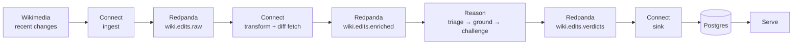

# redpanda-fde-build-exercise

Judge live Wikipedia edits so a human sees the damaging ones first.

Connect reads the Wikimedia recent-changes firehose, keeps human edits to English articles, and fetches the diff behind each one, since the feed itself only says who changed which page and by how many bytes.
Reason has a local model judge each diff, makes it quote its evidence, argues the close calls a second time, and writes a verdict back to a topic.
Connect sinks verdicts into Postgres, and Serve turns that table into a live view at http://localhost:8080.



## Getting Started

You need Docker with Compose and about 12 GB of memory available to containers (the local model is 9.6 GB). On macOS that means raising the Docker Desktop or Colima memory limit.

First start pulls `gemma4:e4b` into the Ollama volume, which takes a few minutes; `reason` waits until it is there.

```sh
docker compose up --build
```

> [!TIP]
> `make up` does the same detached, opens the page in your browser once every service is up, and follows the logs. `make down` stops the stack.

Then open:

- http://localhost:8080 for the verdicts page, which updates as verdicts land
- http://localhost:8080/api/verdicts for JSON, filtered by `route`, `label`, `min_confidence`, and `limit`
- http://localhost:8080/api/stats for counts by route and label
- http://localhost:8081 for Redpanda Console, to look at the topics

On CPU the model takes tens of seconds per edit, so the first verdicts appear a minute or two after it finishes loading. Logged-out editors, empty summaries, and large changes always reach the model; the rest is sampled at 5%.

> [!TIP]
> To use a hosted model instead, copy [`.env.example`](.env.example) to `.env` and set `LLM_BASE_URL`, `LLM_MODEL`, and `LLM_API_KEY`. Setting `OLLAMA_MODEL=` skips the download. Any provider that speaks the OpenAI chat-completions shape works, including Ollama running natively on the host (`LLM_BASE_URL=http://host.docker.internal:11434/v1`), which is much faster than Ollama inside a container on a Mac.

### Things To Look At

**Loop** in [`reason/reason.go`](reason/reason.go) runs each edit through six steps:

1. Gate: an edit whose diff could not be fetched is recorded as skipped, not guessed at.
2. Triage: the model sees the title, the editor type, the summary, the byte delta, and the diff, and answers with a label, a confidence, a one-sentence reason, and a verbatim quote from the diff.
3. Parse: the first JSON object that decodes is pulled out of whatever the model wrote (prose, code fences, thinking blocks), the label is normalised onto the fixed set, the confidence is coerced to 0..1. Anything unusable goes back to the model with the problem attached. The last attempt forces JSON mode.
4. Ground: the quoted evidence must appear in the diff, exactly or as one long run that a small model mangled by a character. If not, the model is asked once more to quote exactly; if it still cannot, its confidence is capped and the edit goes to human review whatever the label.
5. Challenge: a grounded verdict below the high-confidence threshold, or labelled unclear, gets a fresh conversation that must argue the opposite case before deciding. That answer replaces the first unless it is unusable, in which case the first stands.
6. Route: damaging labels at or above the high threshold are `flagged`, constructive edits at or above the low threshold are `ok`, everything else is `review`.

Labels are `constructive`, `vandalism`, `spam`, `unsourced_claim`, and `unclear`. `unreviewed` marks records the loop gave up on.

Reason commits an offset only after the verdict is on `wiki.edits.verdicts`. A model or broker it cannot reach is retried with backoff, never recorded as a verdict ([`reason/consumer.go`](reason/consumer.go)).

**Prompts** in [`reason/prompt.go`](reason/prompt.go) are the system prompt that defines the labels and the JSON shape, the repair prompt for an unusable reply, the grounding prompt for a quote that is not in the diff, and the challenge prompt. Edit and rebuild `reason` to change them.

**Pipelines** are the three Connect configs. Everything that is not reasoning lives here.

- [`ingest/ingest.yaml`](ingest/ingest.yaml) reads the SSE firehose, keeps human edits to English Wikipedia articles, and writes them to `wiki.edits.raw`.
- [`transform/transform.yaml`](transform/transform.yaml) drops reverts, tiers and samples what is left, fetches the unified diff from the MediaWiki compare API at 5 requests per second, and writes `wiki.edits.enriched`. A failed fetch is recorded on the message, not dropped, so the gate can skip it.
- [`serve/sink.yaml`](serve/sink.yaml) upserts verdicts into Postgres by revision id.

**Schema** in [`serve/schema.sql`](serve/schema.sql) is the `verdicts` table the sink upserts and Serve reads, plus the trigger that tells Serve about each upsert. The sink applies it on start.

**Env** knobs are optional and go in `.env`:

- `SAMPLE_PERMILLE`: share of non-priority edits that reach the model, per thousand (default 50)
- `DIFF_MAX_CHARS`: diff text sent to the model is cut here (default 4000)
- `HIGH_CONFIDENCE`: at or above this a damaging verdict is flagged without a challenge (default 0.8)
- `LOW_CONFIDENCE`: below this a constructive verdict goes to review (default 0.5)
- `MAX_ATTEMPTS`: model calls per stage before the loop gives up (default 3)
- `LOG_LEVEL`: `debug` logs every unusable model reply (default `info`)

**Testing** is `make test`. [`reason/reason_test.go`](reason/reason_test.go) drives the loop with a scripted model: dirty output, repairs, hallucinated evidence, the challenge pass, the exhausted budget, and the transport failure that must not produce a verdict. [`reason/parse_test.go`](reason/parse_test.go) covers the parser on its own. CI runs the same tests plus lint and a vulnerability check.

**Rebuild the table** with `make reset-sink`. It drops `verdicts`, deletes the sink's consumer group, and restarts the sink so it replays the topic from the beginning.

## Tradeoffs

## Surprises And Production Notes

## Why This Matters
